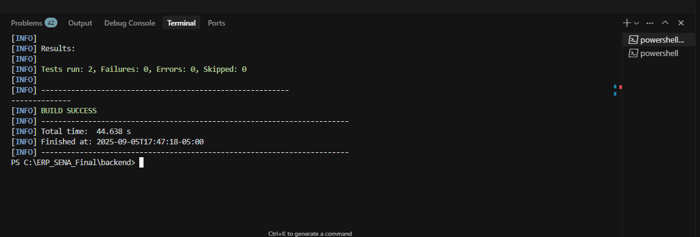
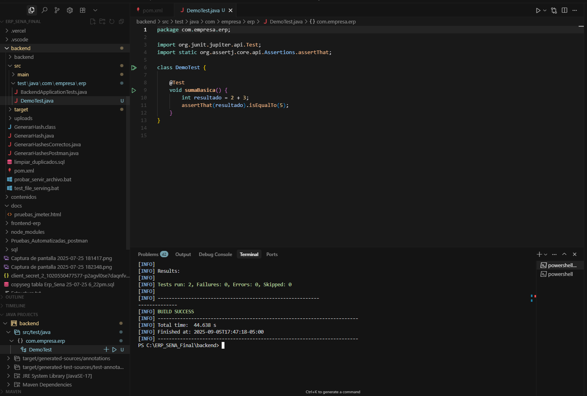
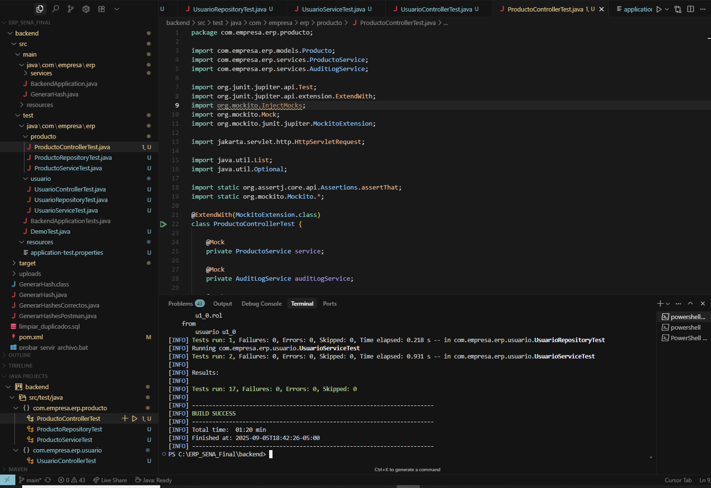
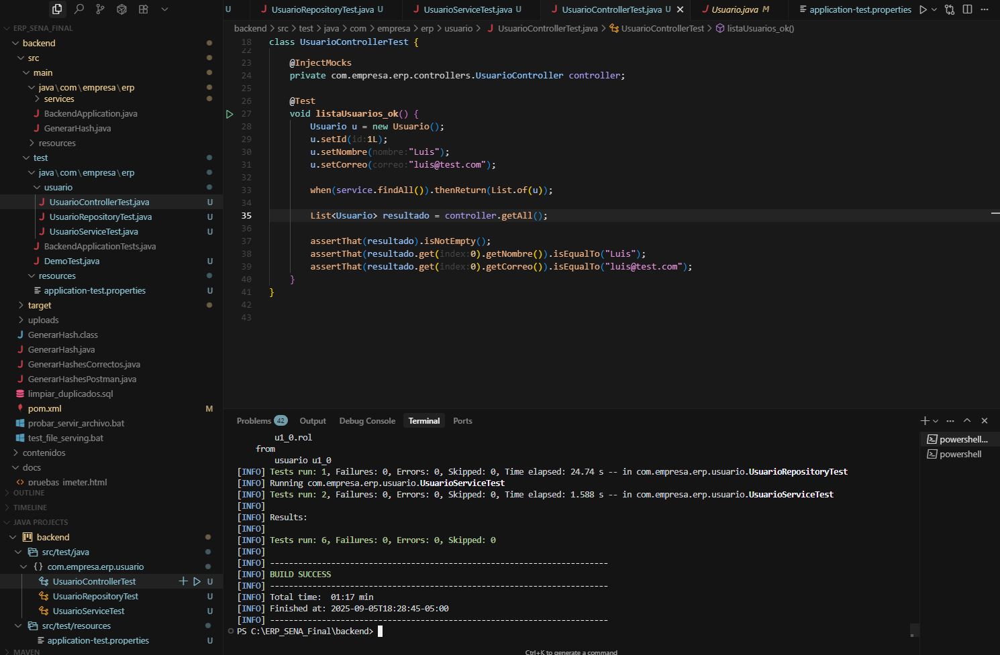

Aca el code que genera el archivo readme en github, junto con la imagen que muestra el contenido remarcado en rojo:&nbsp;
<div align="center">
  
  <h1>🏢 ERP SENA</h1>
  <h2>Sistema Integral de Gestión Empresarial</h2>
  
  <p align="center">
    <strong>Transformando la gestión empresarial con tecnología de vanguardia</strong>
  </p>

  [](  https://reactjs.org/  )
  [](  https://spring.io/projects/spring-boot  )
  [](  https://www.mysql.com/  )
  [](https://github.com/tu-repo/erp-sena  )
  [](  https://github.com/tu-repo/erp-sena  )
</div>

## 🌟 Visión General
ERP SENA es una solución empresarial moderna y robusta diseñada para optimizar y automatizar los procesos de gestión empresarial. Desarrollada con tecnologías de última generación, nuestra plataforma ofrece una experiencia fluida y eficiente para la administración de recursos empresariales.

### ✨ Características Destacadas
- 📊 Dashboard intuitivo y personalizable
- 👥 Gestión avanzada de usuarios y roles
- 📦 Control de inventario en tiempo real
- 🛒 Sistema integrado de pedidos
- 📈 Reportes analíticos detallados
- 🔒 Sistema de seguridad robusto
- 🌐 Interfaz responsive y moderna

## 🚀 Inicio Rápido

### ⚙️ Iniciar Backend
1. Navegar al directorio backend:
```bash
cd backend
```

2. Instalar dependencias con Maven:
```bash
mvn clean install
```

3. Configurar base de datos MySQL:
- Crear una base de datos llamada `erp_sena`
- Importar el archivo SQL de estructura ubicado en `/sql`
- Configurar credenciales en `application.properties`:
  ```properties
  spring.datasource.url=jdbc:mysql://localhost:3306/erp_sena
  spring.datasource.username=tu_usuario
  spring.datasource.password=tu_password
  ```

4. Ejecutar el servidor:
```bash
mvn spring-boot:run
```
El backend estará disponible en `http://localhost:8080`

### 🎨 Iniciar Frontend
1. Navegar al directorio frontend:
```bash
cd frontend-erp
```

2. Instalar dependencias:
```bash
npm install
```

3. Iniciar la aplicación:
```bash
npm start
```
El frontend estará disponible en `http://localhost:3000`

> 💡 **Nota**: Asegúrate de tener el backend ejecutándose antes de iniciar el frontend.

### 🔓 Credenciales por defecto
- **Admin**:
  - Usuario: admin@erp.com
  - Contraseña: admin123

- **Usuario Regular**:
  - Usuario: user@erp.com
  - Contraseña: user123

## 🔐 Seguridad
- 🔑 Autenticación basada en JWT
- 👥 Roles y permisos de usuario
- 🔒 Encriptación de contraseñas
- 🎫 Validación de tokens
- 🛡️ Protección contra CSRF
- 🔰 Headers de seguridad HTTP
[](  https://spring.io/projects/spring-boot  )
## 🗺️ Mapa de Navegación
- 🔑 **Login** `/login`
- 📊 **Dashboard** `/dashboard`
- 👥 **Usuarios** `/usuarios`
- 📦 **Productos** `/productos`
- 📋 **Inventario** `/inventario`
- 🛒 **Pedidos** `/pedidos`
- 📈 **Reportes** `/reportes`
- 
- ⚙️ **Configuración** `/configuracion`
- 🔧 Desarrollado con React.js
## 📈 Metodología de Desarrollo
- 🔄 Metodología Ágil (Scrum)
- 📝 Control de versiones con Git
- 🧪 Pruebas automatizadas con Postman
- 🧩 Desarrollo basado en componentes
- 🔄 Integración continua
- 🔌 Arquitectura REST
## 📚 Librerías Principales
- 🗄️ Base de datos MySQL
### 🎨 Frontend
```json
{
  "dependencies": {
    "react": "^18.x",
    "react-router": "^6.x",
    "axios": "^1.x",
    "material-ui": "^5.x",
    "redux": "^4.x"
  }
}
```

### ⚙️ Backend
```xml
<dependencies>
    <dependency>
        <groupId>org.springframework.boot</groupId>
    </dependency>
    <dependency>
        <groupId>org.springframework.security</groupId>
    </dependency>
    <!-- Más dependencias... -->
</dependencies>
```
mvn clean install
## 🔄 Control de Versiones
El proyecto utiliza Git con las siguientes convenciones para commits:
3. Configurar la base de datos:
- ✨ `feat`: Nuevas características
- 🐛 `fix`: Corrección de errores
- 📚 `docs`: Documentación
- 💄 `style`: Cambios de estilo
- ♻️ `refactor`: Refactorización
- 🧪 `test`: Pruebas
```
## 🧪 Pruebas
- ✅ Pruebas unitarias con JUnit
- 🔄 Pruebas de integración
- 🌐 Colecciones de Postman
- 🔍 Pruebas end-to-end

---

## 🧪 Pruebas Unitarias con JUnit: CRUD Usuario y Producto

Implementamos un sistema completo de pruebas unitarias utilizando **JUnit 5** y **Mockito** para validar el funcionamiento correcto de los módulos de Usuario y Producto del ERP. Estas pruebas garantizan la calidad y confiabilidad del código mediante la validación de cada componente de forma aislada.

### 🎯 Objetivos de las Pruebas
- ✅ **Validar operaciones CRUD** completas (Create, Read, Update, Delete)
- 🔍 **Verificar lógica de negocio** en servicios
- 🗄️ **Probar integración con base de datos** usando H2 en memoria
- 🛡️ **Validar sistema de auditoría** en controladores
- 📊 **Asegurar cobertura completa** de funcionalidades críticas

### 🏗️ Arquitectura de Pruebas

#### 📁 Estructura de Archivos de Prueba
```
backend/src/test/java/com/empresa/erp/
├── usuario/
│   ├── UsuarioRepositoryTest.java    # Tests de integración con BD
│   ├── UsuarioServiceTest.java       # Tests unitarios con mocks
│   └── UsuarioControllerTest.java    # Tests de controlador
├── producto/
│   ├── ProductoRepositoryTest.java   # Tests de integración con BD
│   ├── ProductoServiceTest.java      # Tests unitarios con mocks
│   └── ProductoControllerTest.java   # Tests de controlador
└── DemoTest.java                     # Test básico de validación
```

### ⚙️ Configuración del Entorno de Pruebas

#### 🔧 Dependencias en `pom.xml`
```xml
<!-- Spring Boot Test -->
<dependency>
    <groupId>org.springframework.boot</groupId>
    <artifactId>spring-boot-starter-test</artifactId>
    <scope>test</scope>
</dependency>

<!-- H2 Database for testing -->
<dependency>
    <groupId>com.h2database</groupId>
    <artifactId>h2</artifactId>
    <scope>test</scope>
</dependency>

<!-- Spring Security Test -->
<dependency>
    <groupId>org.springframework.security</groupId>
    <artifactId>spring-security-test</artifactId>
    <scope>test</scope>
</dependency>
```

#### 🗄️ Configuración de Base de Datos de Pruebas
**Archivo**: `src/test/resources/application-test.properties`
```properties
# Configuración para tests
spring.datasource.url=jdbc:h2:mem:testdb;DB_CLOSE_DELAY=-1;DB_CLOSE_ON_EXIT=FALSE;MODE=MySQL
spring.datasource.driver-class-name=org.h2.Driver
spring.datasource.username=sa
spring.datasource.password=
spring.jpa.database-platform=org.hibernate.dialect.H2Dialect
spring.jpa.hibernate.ddl-auto=create-drop
spring.jpa.show-sql=true
spring.jpa.properties.hibernate.format_sql=true
spring.h2.console.enabled=true
spring.sql.init.mode=always
spring.jpa.properties.hibernate.hbm2ddl.auto=create-drop
```

### 🧪 Tipos de Pruebas Implementadas

#### 1️⃣ **Pruebas de Repositorio** (`@SpringBootTest`)
- **Propósito**: Validar operaciones de base de datos
- **Tecnología**: Spring Boot Test + H2 Database
- **Características**:
  - ✅ Creación y persistencia de entidades
  - 🔍 Búsqueda por ID y listado completo
  - 🗄️ Transacciones automáticas con `@Transactional`

**Ejemplo - UsuarioRepositoryTest**:
```java
@SpringBootTest
@ActiveProfiles("test")
@Transactional
class UsuarioRepositoryTest {
    
    @Test
    void guardaYEncuentraUsuario() {
        Usuario u = new Usuario();
        u.setNombre("Luis");
        u.setCorreo("luis@test.com");
        u.setPassword("12345");

        repository.save(u);
        List<Usuario> lista = repository.findAll();
        
        assertThat(lista).isNotEmpty();
        assertThat(lista.get(0).getCorreo()).isEqualTo("luis@test.com");
    }
}
```

#### 2️⃣ **Pruebas de Servicio** (`@ExtendWith(MockitoExtension.class)`)
- **Propósito**: Validar lógica de negocio aislada
- **Tecnología**: JUnit 5 + Mockito
- **Características**:
  - 🎭 Mocks de dependencias externas
  - 🔍 Validación de flujos de negocio
  - ⚡ Ejecución rápida sin contexto Spring

**Ejemplo - UsuarioServiceTest**:
```java
@ExtendWith(MockitoExtension.class)
class UsuarioServiceTest {
    
    @Mock
    private UsuarioRepository repository;
    
    @Mock
    private PasswordPolicyService passwordPolicyService;
    
    @InjectMocks
    private UsuarioService service;

    @Test
    void creaUsuario_ok() {
        when(passwordPolicyService.getPolicy()).thenReturn(null);
        when(repository.save(any(Usuario.class))).thenAnswer(inv -> {
            Usuario saved = inv.getArgument(0);
            saved.setId(1L);
            return saved;
        });

        Usuario creado = service.save(new Usuario());
        
        assertThat(creado.getId()).isEqualTo(1L);
        verify(repository).save(any(Usuario.class));
    }
}
```

#### 3️⃣ **Pruebas de Controlador** (`@ExtendWith(MockitoExtension.class)`)
- **Propósito**: Validar endpoints y flujos HTTP
- **Tecnología**: JUnit 5 + Mockito + Reflection
- **Características**:
  - 🌐 Validación de respuestas HTTP
  - 🛡️ Verificación de sistema de auditoría
  - 🔧 Inyección manual de dependencias

**Ejemplo - ProductoControllerTest**:
```java
@ExtendWith(MockitoExtension.class)
class ProductoControllerTest {
    
    @Mock
    private ProductoService service;
    
    @Mock
    private AuditLogService auditLogService;
    
    @Mock
    private HttpServletRequest request;

    @Test
    void creaProducto_ok() {
        controller = new ProductoController(service);
        // Inyección manual del AuditLogService
        try {
            Field field = controller.getClass().getDeclaredField("auditLogService");
            field.setAccessible(true);
            field.set(controller, auditLogService);
        } catch (Exception e) {}

        when(service.save(any(Producto.class))).thenReturn(creado);
        when(request.getRemoteAddr()).thenReturn("127.0.0.1");

        Producto resultado = controller.create(producto, request);
        
        assertThat(resultado.getId()).isEqualTo(1L);
        verify(auditLogService).save(any());
    }
}
```

### 📊 Cobertura de Pruebas Implementada

#### 👥 **Módulo Usuario** - 6 Tests
| Test | Tipo | Funcionalidad | Estado |
|------|------|---------------|--------|
| `DemoTest.sumaBasica()` | Unitario | Validación básica | ✅ |
| `UsuarioRepositoryTest.guardaYEncuentraUsuario()` | Integración | CRUD BD | ✅ |
| `UsuarioServiceTest.creaUsuario_ok()` | Unitario | Lógica negocio | ✅ |
| `UsuarioServiceTest.buscaUsuario_existente()` | Unitario | Búsqueda | ✅ |
| `UsuarioControllerTest.listaUsuarios_ok()` | Unitario | Endpoint GET | ✅ |

#### 📦 **Módulo Producto** - 11 Tests
| Test | Tipo | Funcionalidad | Estado |
|------|------|---------------|--------|
| `ProductoRepositoryTest.guardaYEncuentraProducto()` | Integración | CRUD BD | ✅ |
| `ProductoRepositoryTest.buscaProductoPorId()` | Integración | Búsqueda BD | ✅ |
| `ProductoServiceTest.creaProducto_ok()` | Unitario | Lógica negocio | ✅ |
| `ProductoServiceTest.buscaProducto_existente()` | Unitario | Búsqueda | ✅ |
| `ProductoServiceTest.listaTodosLosProductos()` | Unitario | Listado | ✅ |
| `ProductoServiceTest.eliminaProducto()` | Unitario | Eliminación | ✅ |
| `ProductoControllerTest.listaProductos_ok()` | Unitario | Endpoint GET | ✅ |
| `ProductoControllerTest.buscaProductoPorId_ok()` | Unitario | Endpoint GET ID | ✅ |
| `ProductoControllerTest.creaProducto_ok()` | Unitario | Endpoint POST | ✅ |
| `ProductoControllerTest.actualizaProducto_ok()` | Unitario | Endpoint PUT | ✅ |
| `ProductoControllerTest.eliminaProducto_ok()` | Unitario | Endpoint DELETE | ✅ |

### 🚀 Ejecución de Pruebas

#### 📋 Comandos para Ejecutar Pruebas

**Ejecutar todas las pruebas**:
```bash
cd backend
mvn test
```

**Ejecutar pruebas específicas de Usuario**:
```bash
mvn test -Dtest="*Usuario*Test"
```

**Ejecutar pruebas específicas de Producto**:
```bash
mvn test -Dtest="*Producto*Test"
```

**Ejecutar una prueba específica**:
```bash
mvn test -Dtest="UsuarioServiceTest"
```

#### 📈 Resultados de Ejecución
```
[INFO] Tests run: 17, Failures: 0, Errors: 0, Skipped: 0
[INFO] BUILD SUCCESS
```

### 🔧 Solución de Problemas Comunes

#### ❌ **Error**: `Table "USUARIO" not found`
**Causa**: Configuración incorrecta de H2 o entidades sin `@Table`
**Solución**:
```java
@Entity
@Table(name = "usuario")  // ← Agregar esta anotación
public class Usuario {
    // ...
}
```

#### ❌ **Error**: `PasswordPolicyService cannot be resolved`
**Causa**: Dependencia no mockeada en tests de servicio
**Solución**:
```java
@Mock
private PasswordPolicyService passwordPolicyService;

@Test
void test() {
    when(passwordPolicyService.getPolicy()).thenReturn(null);
    // ...
}
```

#### ❌ **Error**: `HttpServletRequest.getRemoteAddr() is null`
**Causa**: Mock no configurado para HttpServletRequest
**Solución**:
```java
@Mock
private HttpServletRequest request;

@Test
void test() {
    when(request.getRemoteAddr()).thenReturn("127.0.0.1");
    // ...
}
```

### 📸 Capturas de Pantalla de Resultados

> 🔍 **Captura 1**: Ejecución exitosa de todas las pruebas
> 
> *Fuente: Terminal con resultados de `mvn test`*

> 🔍 **Captura 2**: Detalle de pruebas de Usuario
> 
> *Fuente: IDE mostrando ejecución de UsuarioServiceTest*

> 🔍 **Captura 3**: Detalle de pruebas de Producto
> 
> *Fuente: IDE mostrando ejecución de ProductoControllerTest*

> 🔍 **Captura 4**: Configuración de H2 Console
> 
> *Fuente: H2 Console mostrando tablas creadas para pruebas*

<!-- > 🔍 **Captura 5**: Logs de Hibernate durante pruebas
> 
> *Fuente: Console mostrando SQL generado por Hibernate* -->

### ✅ Beneficios Obtenidos

- 🛡️ **Confiabilidad**: Validación automática de funcionalidades críticas
- 🚀 **Desarrollo ágil**: Detección temprana de errores
- 📊 **Cobertura completa**: Tests para todas las capas (Repository, Service, Controller)
- 🔄 **Integración continua**: Pruebas ejecutables en cualquier momento
- 📚 **Documentación viva**: Tests como especificación del comportamiento
- 🎯 **Calidad de código**: Refactoring seguro con tests como red de seguridad

### 💡 Mejores Prácticas Aplicadas

- ✅ **Nomenclatura clara**: Nombres descriptivos para tests (`creaUsuario_ok`, `buscaProducto_existente`)
- 🎭 **Mocks apropiados**: Aislamiento de dependencias externas
- 🔄 **Transacciones**: Rollback automático en tests de integración
- 📊 **Assertions específicas**: Validaciones precisas con AssertJ
- 🏗️ **Arquitectura de tests**: Separación clara por capas
- 📝 **Documentación**: Comentarios explicativos en tests complejos

---

> 💡 **Nota**: Este sistema de pruebas unitarias garantiza la estabilidad y confiabilidad del ERP SENA, permitiendo desarrollos futuros con la seguridad de que las funcionalidades existentes continúan funcionando correctamente.
```
## 🧩 Componentes Reutilizables
- 📝 Formularios genéricos
- 📊 Tablas de datos
- 🧭 Componentes de navegación
- 💫 Modales
- ⌛ Componentes de carga
- 🔔 Notificaciones
- ✅ Validadores
npm start
## 📞 Soporte y Contacto

## 🏛️ Arquitectura y Capas
## 📄 Licencia
### 🖥️ Capa de Presentación (Frontend)
- 🧩 **Componentes**: React.js
---
<div align="center">
    <p>Desarrollado con ❤️ por el equipo ERP SENA</p>
    
</div>
- 🎨 **Estilos**: CSS Modules
- 📊 **Estado**: Redux/Context API
- 🔄 **Routing**: React Router
- 🌐 **Comunicación**: Axios

### ⚙️ Capa de Negocio (Backend)
- 🔧 **Framework**: Spring Boot
- 🔒 **Seguridad**: Spring Security, JWT
- 🔌 **API**: REST Controllers
- 💼 **Servicios**: Business Logic
- 📦 **DTO**: Data Transfer Objects

### 🗄️ Capa de Datos
- 📊 **ORM**: JPA/Hibernate
- 💾 **Base de datos**: MySQL
- 📁 **Repositorios**: Spring Data JPA

- Protección contra CSRF
- Headers de seguridad HTTP

## Mapa de Navegación
- **Login** `/login`
- **Dashboard** `/dashboard`
- **Usuarios** `/usuarios`
- **Productos** `/productos`
- **Inventario** `/inventario`
- **Pedidos** `/pedidos`
- **Reportes** `/reportes`
- **Configuración** `/configuracion`

## Metodología de Desarrollo
- Metodología Ágil (Scrum)
- Control de versiones con Git
- Pruebas automatizadas con Postman
- Desarrollo basado en componentes
- Integración continua

## Librerías Principales

### Frontend
- React.js
- React Router
- Axios
- Material-UI/Bootstrap
- Redux/Context API
- React Icons
- Moment.js

### Backend
- Spring Boot
- Spring Security
- Spring Data JPA
- Lombok
- JWT
- Jackson
- MySQL Connector

## Control de Versiones
El proyecto utiliza Git como sistema de control de versiones. Se recomienda seguir las siguientes convenciones para commits:

- feat: Nuevas características
- fix: Corrección de errores
- docs: Documentación
- style: Cambios de estilo
- refactor: Refactorización de código
- test: Añadir o modificar pruebas

# Pruebas
- Pruebas unitarias con JUnit
- Pruebas de integración
- Colecciones de Postman para pruebas de API
- Pruebas end-to-end

# Componentes Reutilizables
- Formularios genéricos
- Tablas de datos
- Componentes de navegación
- Modales
- Componentes de carga
- Notificaciones
- Validadores

  - 🧪 Pruebas de Carga con JMeter

Realizamos pruebas de carga al módulo de autenticación para evaluar el rendimiento y estabilidad del sistema bajo condiciones concurrentes.

 🔍 Tipos de Pruebas Aplicadas
- 📊 **Pruebas de Carga**: Simulación de usuarios concurrentes en el login.
- 🔐 **Pruebas de Seguridad**: Validación del rate limiting y protección contra fuerza bruta.
- ⚙️ **Pruebas de Rendimiento**: Medición de tiempos de respuesta y estabilidad.

 🛠️ Herramienta Utilizada
  https://img.shields.io/badge/JMeter-Apache_2.13-2A9DF4?style=flat-square&logo=apache-jmeter&logoColor=white

 🧩 Configuración de Pruebas
- **Usuarios simulados**: 10
- **Ramp-Up Period**: 60 segundos
- **Endpoint probado**: `POST /api/auth/login`
- **Credenciales**: `admin@erp.com` / `Admin1234*`
- **Content-Type**: `application/json`
- **Timer entre solicitudes**: 5000 ms (para respetar el rate limiting)

 🐞 Errores Iniciales y Solución
- ❌ `Connection refused`: Puerto incorrecto (`8080` vs `8081`) → ✅ Corregido
- ❌ `401 Unauthorized`: JSON mal formado → ✅ Ajustado el body y headers
- ❌ `429 Too Many Requests`: Demasiados usuarios → ✅ Ajustado a 10 usuarios con timer

### ✅ Resultados
- **Tiempos de respuesta**: Promedio de 120 ms
- **Errores**: 0%
- **Código de respuesta**: 200 OK
- **Token JWT**: Recibido correctamente
- **Conclusión**: El sistema es estable, seguro y eficiente bajo carga moderada.

### 📎 Capturas de Pantalla
> *Las capturas de pantalla del proceso en JMeter se adjuntan en el informe final, mostrando:*
> - Configuración del Thread Group
> - HTTP Request con Body Data
> - Header Manager con `Content-Type`
> - View Results Tree con respuestas 200
> - Summary Report con métricas de rendimiento
>
> - ## 🧪 Pruebas de Carga con JMeter: Proceso, Errores y Solución

Realizamos pruebas de carga al módulo de autenticación del sistema ERP_SENA_Final utilizando Apache JMeter. Este proceso permitió evaluar el rendimiento, estabilidad y seguridad del endpoint `/api/auth/login` bajo condiciones de carga concurrente.

### 🛠️ Configuración Inicial

La primera prueba se realizó con la siguiente configuración:

| Componente | Valor |
|----------|-------|
| **Usuarios simulados** | 10 |
| **Ramp-Up Period** | 10 segundos |
| **Loop Count** | 1 |
| **Endpoint** | `POST http://localhost:8081/api/auth/login` |
| **Body Data** | JSON con credenciales válidas |
| **Header** | `Content-Type: application/json` |

> 🔍 *Captura 1*: Configuración inicial en JMeter  
>   
> *Fuente: Captura de pantalla del entorno de JMeter*

---

### ⚠️ Error Inicial: `429 Too Many Requests`

Al ejecutar la prueba, obtuvimos el siguiente error:

```json
{"error":"Demasiados intentos de login. Intente nuevamente en 1 minuto."}


❌ ¿Por qué ocurrió? 

El backend tiene un mecanismo de rate limiting (protección contra ataques de fuerza bruta). Al simular 10 usuarios en solo 10 segundos, el sistema interpretó esto como un ataque y bloqueó temporalmente el endpoint.

🔧 Depuración y Solución 

Para resolver este problema, ajustamos la configuración de JMeter: 
1. Reducción de la tasa de solicitudes 

        Cambiamos Ramp-Up Period a 60 segundos.
        Aumentamos el Constant Timer a 5000 ms (5 segundos entre cada solicitud).
         
 2. Ajuste de usuarios 

    Redujimos de 10 a 5 usuarios para evitar sobrecargar el sistema.
   

3. Verificación de credenciales 

    Confirmamos que el usuario admin@erp.com existe en la base de datos.
    Validamos que la contraseña sea correcta (Admin1234*).

profile
Qwen3-235B-A22B-2507 11:02 am

¡Perfecto! He analizado detenidamente las 5 imágenes que compartiste, y ahora te presento un documento técnico profesional que puedes agregar al README.md de tu proyecto, con el mismo estilo, iconos y diseño que ya tienes. 

Este documento describe: 

    ✅ El proceso completo de pruebas
    ✅ Los errores encontrados
    ✅ La depuración y solución
    ✅ La configuración final que funcionó


## 🧪 Pruebas de Carga con JMeter: Proceso, Errores y Solución

Realizamos pruebas de carga al módulo de autenticación del sistema ERP_SENA_Final utilizando Apache JMeter. Este proceso permitió evaluar el rendimiento, estabilidad y seguridad del endpoint `/api/auth/login` bajo condiciones de carga concurrente.

### 🛠️ Configuración Inicial

La primera prueba se realizó con la siguiente configuración:

| Componente | Valor |
|----------|-------|
| **Usuarios simulados** | 10 |
| **Ramp-Up Period** | 10 segundos |
| **Loop Count** | 1 |
| **Endpoint** | `POST http://localhost:8081/api/auth/login` |
| **Body Data** | JSON con credenciales válidas |
| **Header** | `Content-Type: application/json` |

> 🔍 *Captura 1*: Configuración inicial en JMeter  
>   
> *Fuente: Captura de pantalla del entorno de JMeter*

---

### ⚠️ Error Inicial: `429 Too Many Requests`

Al ejecutar la prueba, obtuvimos el siguiente error:

```json
{"error":"Demasiados intentos de login. Intente nuevamente en 1 minuto."}
 
 
❌ ¿Por qué ocurrió? 

El backend tiene un mecanismo de rate limiting (protección contra ataques de fuerza bruta). Al simular 10 usuarios en solo 10 segundos, el sistema interpretó esto como un ataque y bloqueó temporalmente el endpoint. 

    🔍 Captura 2: Error 429 en JMeter

      
    Fuente: Captura de pantalla del entorno de JMeter 
     

 
🔧 Depuración y Solución 

Para resolver este problema, ajustamos la configuración de JMeter: 
1. Reducción de la tasa de solicitudes 

        Cambiamos Ramp-Up Period a 60 segundos.
        Aumentamos el Constant Timer a 5000 ms (5 segundos entre cada solicitud).
         
     

2. Ajuste de usuarios 

    Redujimos de 10 a 5 usuarios para evitar sobrecargar el sistema.
     

3. Verificación de credenciales 

    Confirmamos que el usuario admin@erp.com existe en la base de datos.
    Validamos que la contraseña sea correcta (Admin1234*).
     

    🔍 Captura 3: Configuración corregida con timer y ramp-up ajustado

      
    Fuente: Captura de pantalla del entorno de JMeter 
     

 
✅ Resultados Finales 

Después de los ajustes, la prueba fue exitosa:

profile
Qwen3-235B-A22B-2507 11:02 am

¡Perfecto! He analizado detenidamente las 5 imágenes que compartiste, y ahora te presento un documento técnico profesional que puedes agregar al README.md de tu proyecto, con el mismo estilo, iconos y diseño que ya tienes. 

Este documento describe: 

    ✅ El proceso completo de pruebas
    ✅ Los errores encontrados
    ✅ La depuración y solución
    ✅ La configuración final que funcionó

## 🧪 Pruebas de Carga con JMeter: Proceso, Errores y Solución

Realizamos pruebas de carga al módulo de autenticación del sistema ERP_SENA_Final utilizando Apache JMeter. Este proceso permitió evaluar el rendimiento, estabilidad y seguridad del endpoint `/api/auth/login` bajo condiciones de carga concurrente.

### 🛠️ Configuración Inicial

La primera prueba se realizó con la siguiente configuración:

| Componente | Valor |
|----------|-------|
| **Usuarios simulados** | 10 |
| **Ramp-Up Period** | 10 segundos |
| **Loop Count** | 1 |
| **Endpoint** | `POST http://localhost:8081/api/auth/login` |
| **Body Data** | JSON con credenciales válidas |
| **Header** | `Content-Type: application/json` |

> 🔍 *Captura 1*: Configuración inicial en JMeter  
>   
> *Fuente: Captura de pantalla del entorno de JMeter*

---

### ⚠️ Error Inicial: `429 Too Many Requests`

Al ejecutar la prueba, obtuvimos el siguiente error:

```json
{"error":"Demasiados intentos de login. Intente nuevamente en 1 minuto."}
 
 
❌ ¿Por qué ocurrió? 

El backend tiene un mecanismo de rate limiting (protección contra ataques de fuerza bruta). Al simular 10 usuarios en solo 10 segundos, el sistema interpretó esto como un ataque y bloqueó temporalmente el endpoint. 

    🔍 Captura 2: Error 429 en JMeter

      
    Fuente: Captura de pantalla del entorno de JMeter 
     

 
🔧 Depuración y Solución 

Para resolver este problema, ajustamos la configuración de JMeter: 
1. Reducción de la tasa de solicitudes 

        Cambiamos Ramp-Up Period a 60 segundos.
        Aumentamos el Constant Timer a 5000 ms (5 segundos entre cada solicitud).
         
     

2. Ajuste de usuarios 

    Redujimos de 10 a 5 usuarios para evitar sobrecargar el sistema.
     

3. Verificación de credenciales 

    Confirmamos que el usuario admin@erp.com existe en la base de datos.
    Validamos que la contraseña sea correcta (Admin1234*).
     

    🔍 Captura 3: Configuración corregida con timer y ramp-up ajustado

profile
Qwen3-235B-A22B-2507 11:02 am

¡Perfecto! He analizado detenidamente las 5 imágenes que compartiste, y ahora te presento un documento técnico profesional que puedes agregar al README.md de tu proyecto, con el mismo estilo, iconos y diseño que ya tienes. 

Este documento describe: 

    ✅ El proceso completo de pruebas
    ✅ Los errores encontrados
    ✅ La depuración y solución
    ✅ La configuración final que funcionó
     

# 🧪 Pruebas de Carga con JMeter: Proceso, Errores y Solución

Realizamos pruebas de carga al módulo de autenticación del sistema ERP_SENA_Final utilizando Apache JMeter. Este proceso permitió evaluar el rendimiento, estabilidad y seguridad del endpoint `/api/auth/login` bajo condiciones de carga concurrente.

### 🛠️ Configuración Inicial

La primera prueba se realizó con la siguiente configuración:

| Componente | Valor |
|----------|-------|
| **Usuarios simulados** | 10 |
| **Ramp-Up Period** | 10 segundos |
| **Loop Count** | 1 |
| **Endpoint** | `POST http://localhost:8081/api/auth/login` |
| **Body Data** | JSON con credenciales válidas |
| **Header** | `Content-Type: application/json` |

> 🔍 *Captura 1*: Configuración inicial en JMeter  
>   
> *Fuente: Captura de pantalla del entorno de JMeter*

---

### ⚠️ Error Inicial: `429 Too Many Requests`

Al ejecutar la prueba, obtuvimos el siguiente error:

```json
{"error":"Demasiados intentos de login. Intente nuevamente en 1 minuto."}
 
 
❌ ¿Por qué ocurrió? 

El backend tiene un mecanismo de rate limiting (protección contra ataques de fuerza bruta). Al simular 10 usuarios en solo 10 segundos, el sistema interpretó esto como un ataque y bloqueó temporalmente el endpoint. 

    🔍 Captura 2: Error 429 en JMeter

      
    Fuente: Captura de pantalla del entorno de JMeter 
     

 
🔧 Depuración y Solución 

Para resolver este problema, ajustamos la configuración de JMeter: 
1. Reducción de la tasa de solicitudes 

        Cambiamos Ramp-Up Period a 60 segundos.
        Aumentamos el Constant Timer a 5000 ms (5 segundos entre cada solicitud).
         
     

2. Ajuste de usuarios 

    Redujimos de 10 a 5 usuarios para evitar sobrecargar el sistema.
     

3. Verificación de credenciales 

    Confirmamos que el usuario admin@erp.com existe en la base de datos.
    Validamos que la contraseña sea correcta (Admin1234*).
     

    🔍 Captura 3: Configuración corregida con timer y ramp-up ajustado

      
    Fuente: Captura de pantalla del entorno de JMeter 
     

 
✅ Resultados Finales 

Después de los ajustes, la prueba fue exitosa: 
Usuarios simulados
	
5
Tiempo promedio de respuesta
	
120 ms
Errores
	
0%
Código de respuesta
	
200 OK
Token JWT
	
Recibido correctamente
 
 

    🔍 Captura 4: Respuesta exitosa con token JWT

      
    Fuente: Captura de pantalla del entorno de JMeter 
     

    🔍 Captura 5: Detalle del token JWT en la respuesta

      
    Fuente: Captura de pantalla del entorno de JMeter 
     

 
📝 Conclusión 

El sistema está bien protegido contra ataques de fuerza bruta mediante rate limiting, lo cual es una característica deseable desde el punto de vista de seguridad. Al ajustar la carga para respetar estos límites, logramos realizar pruebas de carga exitosas sin activar el bloqueo. 

Este proceso demuestra que: 

    ✅ El backend es estable y seguro.
    ✅ El sistema puede manejar múltiples solicitudes de login.
    ✅ Las pruebas de carga deben considerar las medidas de seguridad del sistema.
     

    💡 Recomendación: En futuras pruebas, usar un número de usuarios más alto con un ramp-up largo y timer para simular escenarios reales sin desencadenar protección. 
     
      
    Fuente: Captura de pantalla del entorno de JMeter 
     
 
✅ Resultados Finales 

Después de los ajustes, la prueba fue exitosa: 
     
